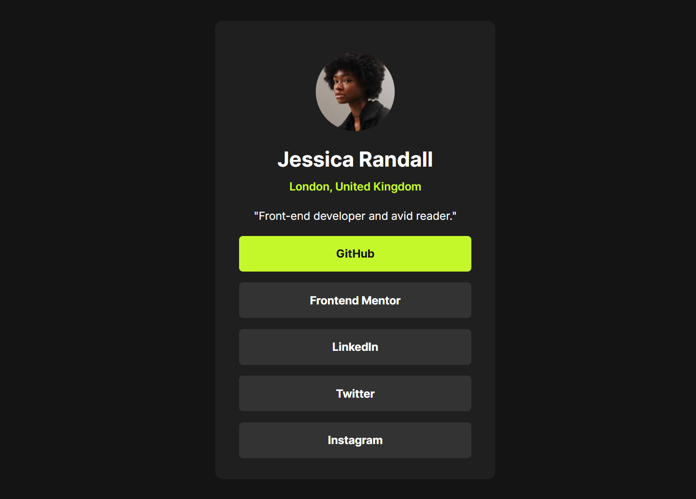

# Social Links Profile



A simple and stylish social links profile page built using HTML and CSS.

## Features
- Clean and responsive design
- Easily customizable
- Supports multiple social media links

## Technologies Used
- HTML
- CSS

## How to Use
1. Clone the repository:
   ```sh
   git clone https://github.com/Amine4jh/social-links-profile.git
   ```
2. Open the `index.html` file in your browser.